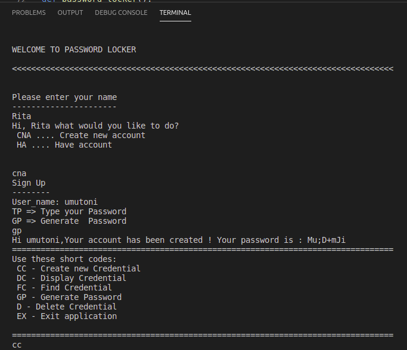

# {Password-Locker}

#### {application that will help us manage our passwords and even generate new passwords for us.}, {15 November 2020}
#### By **{UMUTONI Marie Ritha}**

## Description

{This project is a python application that manages credentials account of a person  i.e. account name, username and passwords for each account. It also stores the passwords and generates a unique password for a user if they do not want to generate new passwords by themselves. }

## Cloning

* UBUNTU
* Open Terminal
* Google Chrome
* internet
* [git clone] (https://github.com/UMUTONIRitha/Password-Locker.git)

## Application Used

* Python
* pip
* pyperclip

## Technology Used

* Python 3.6

## BDD

* Enter a user name
* choose the short codes:
* * cc: Create Credential
* * dc: Display Credential
* * fc: Find Credential
* * gp:Generate Password
* * dc:delete Credential
* * ex:Exit application

## How Password-Locker Project look

## Contact Information

{feel free to contact me via E-mail: rithamarie9@gmail.com in case you need any support or contribution.}

### License

* MIT license,Copyright (c) {2020} **{UMUTONI Marie Ritha}**